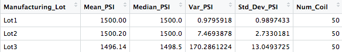

# AutosRUs: MechaCar Analysis

## Project Background
AutosRUs’ has a new car prototype named the MechaCar.  Unfortunately the manufacturing team is running into some trouble.  Not sure how to address the issue, upper managment has asked the Data Analytics team, headed by Jeremy, to review and analyze the production data in hopes of uncovering the cause of their issues.

With the internal data supplied to the team via in 2 csv files: **MechaCar_mpg.csv** and **Suspension_Coil.csv**, the team gets to work with the power of **R** and its many libraries: tidyverse, dplyr, ggplot2.


## Linear Regression to Predict MPG
We start with a linear regression that explores the relationship of the miles per gallon performance (dependent variable) against the 5 other independent variables: 

* length of the vehicle
* weight of the vehicle
* spolier angle
* ground clearance
* AWD: all wheel drive suspension

### Results:


<mark style="background-color: Yellow">Resulting Model:</mark> 

### mpg =  (6.267)**vehicle_length** + (0.0012)**vehicle_weight** + (0.0688)**spoiler_angle** + (3.546)**ground_clearance** + (-3.411)**AWD** + (-104.0)
				

<mark style="background-color: Yellow">Statistical Summary:</mark>  


From the above output we can see that:

1. The **vehicle length**, and **vehicle ground clearance** are statistically likely to provide non-random amounts of variance to the model. That is to say, the vehicle length and vehicle ground clearance have a significant impact on miles per gallon on the MechaCar prototype. Conversely,
the **vehicle weight**, **spoiler angle**, and **All Wheel Drive** (AWD) have p-Values that indicate a random amount of variance with the dataset.  

2. The p-Value for this model, ```p-Value: 5.35e-11```, is much smaller than the assumed significance level of 0.05%. Indicating there is sufficient evidence to **reject our null hypothesis**, which further indcates that the slope of this linear model is **not zero**.


3.  This linear model, has an r-squared value of 0.7149, which means that approximately 72% of all mpg predictions will be determined by this model. Relatively, his mutliple regression model **does predict mpg of MechaCar prototypes effectively**. 

If we remove the less impactful independent variables (vehicle weight, spoiler angle, and All Wheel Drive), the predictability does decrease, but not drastically: the r-squared value falls from 0.7149 to 0.674


## Summary Statistics on Suspension Coils

The Suspension Coil dataset provided for the MechaCar contains the results of testing the weight capacities of multiple suspension coils from multiple production lots to determine consistency. 

First looking at all manufacturing lots:


Diving a little deeper into each lot:




## T-Tests on Suspension Coils

There is a summary of the t-test results across all manufacturing lots and for each lot

## Study Design: MechaCar vs Competition

What metric or metrics are you going to test?
What is the null hypothesis or alternative hypothesis?
What statistical test would you use to test the hypothesis? And why?
What data is needed to run the statistical test?
